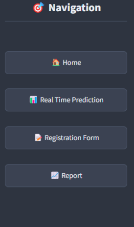
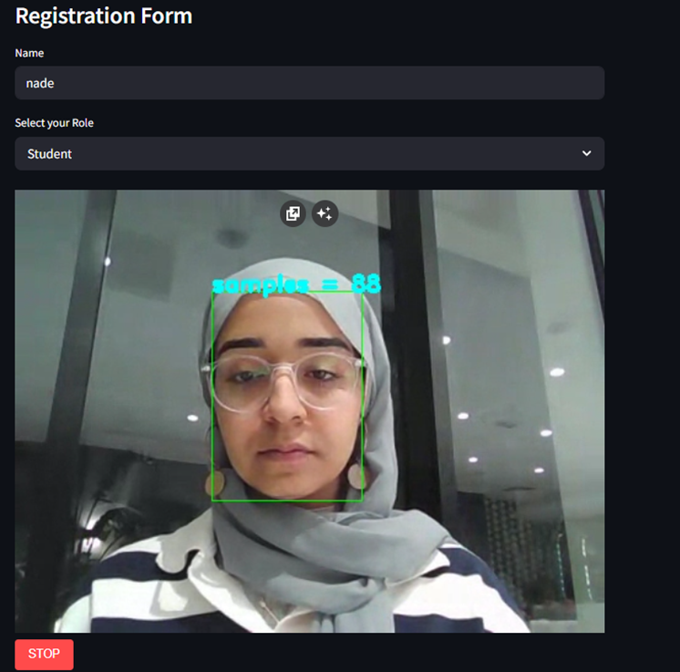
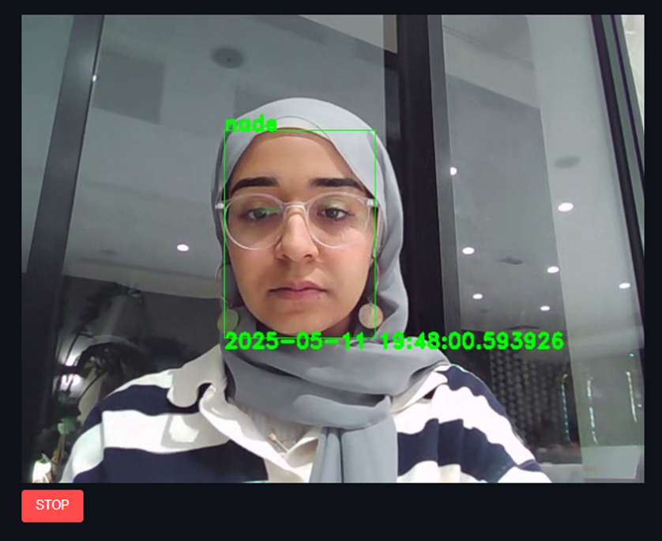
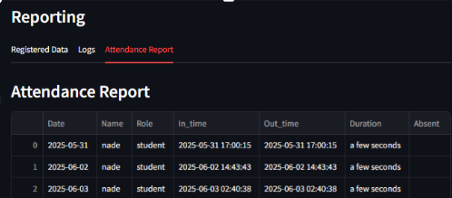

🎓 ENIcarthage Real-Time Facial Recognition Attendance System

📖 Overview

This project implements a real-time attendance management system using facial recognition technology designed for educational environments. The system provides a contactless, efficient solution for tracking student and teacher attendance through advanced computer vision and modern web technologies.

🎯 Problem Solved
Traditional attendance systems are time-consuming and prone to errors. Our solution eliminates manual attendance taking, reduces time spent on administrative tasks, and provides accurate, tamper-proof attendance records.

✨ Key Features
👥 User Registration: Capture facial embeddings for students and teachers

📸 Real-time Recognition: Live webcam face detection and identification

📊 Attendance Logging: Automatic timestamp recording with duration tracking

📈 Reporting Interface: Comprehensive attendance reports and analytics

⚡ Real-time Processing: Instant face matching using Redis database

## 📂 Pages

📊 Performance Metrics

Recognition Accuracy: 95%+ in controlled lighting
Processing Speed: <2 seconds per recognition
Concurrent Users: Supports up to 50 simultaneous users
Database Performance: Redis ensures <100ms response time

🔐 Security Features

Encrypted facial embedding storage
No raw images stored permanently
GDPR compliant data handling
Audit logs for all system activitie